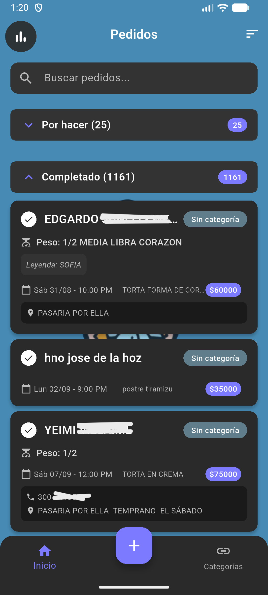
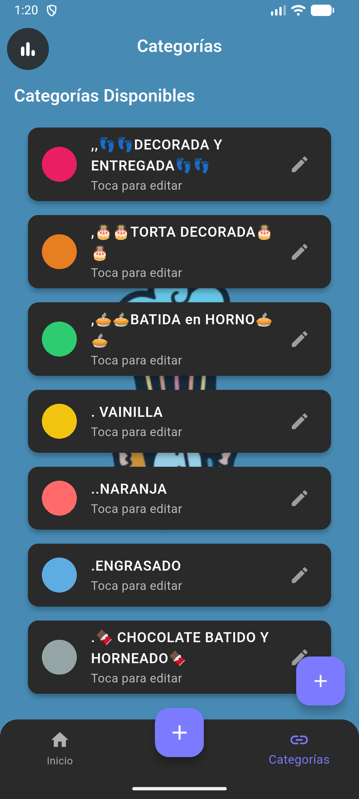
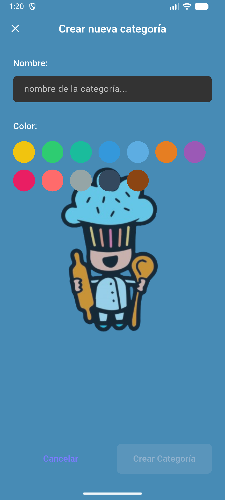
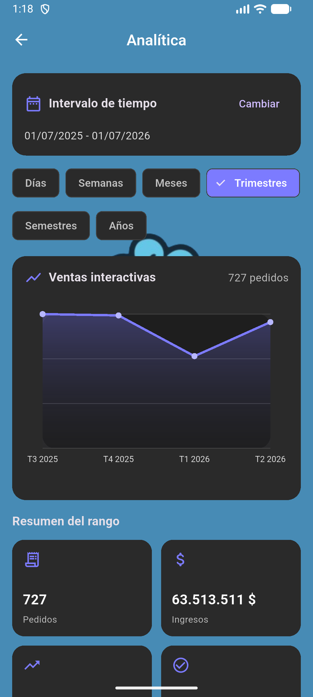
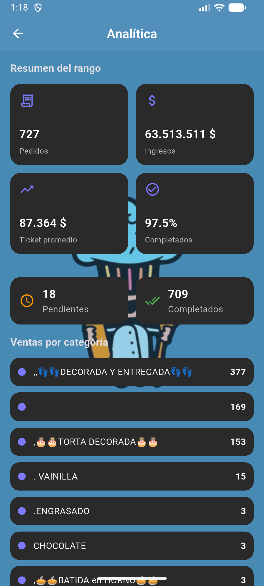

# Juskar - Gestión de pedidos de repostería

Juskar es una aplicación móvil desarrollada con Flutter para administrar pedidos de repostería de forma centralizada. La app utiliza Firebase como base para autenticación de servicios, almacenamiento de datos y gestión de imágenes.

## Funcionalidades principales

- Gestión de pedidos con creación, edición y eliminación.
- Asociación de cada pedido a una categoría personalizable.
- Registro de cliente, contacto, domicilio, descripción, leyenda, libras, valor, abono, fecha de entrega y estado del pedido.
- Carga de múltiples imágenes por pedido.
- Visualización de imágenes en carrusel dentro de cada pedido.
- Confirmación visual de pedidos completados o pendientes.
- Navegación principal con acceso a inicio, creación de pedidos y categorías.
- Gestión de categorías con color personalizado.
- Pantalla de analítica con filtros por rango de fechas y agrupación por días, semanas, meses, trimestres, semestres y años.
- Gráficas interactivas para revisar ventas y comportamiento de pedidos.

## Capturas de pantalla

Guarda las imágenes en la carpeta `docs/screenshots/` y referencia cada archivo en el README con una ruta relativa. El formato recomendado es:

```markdown

```

Si la carpeta no existe, puedes crearla manualmente antes de copiar las capturas.

### Pantalla principal



### Creación y edición de pedidos


### Gestión de categorías




### Analítica




## Tecnologías utilizadas

- Flutter
- Dart
- Firebase Core
- Cloud Firestore
- Firebase Storage
- Firebase Analytics
- image_picker
- intl

## Estructura general del proyecto

```text
lib/
├── main.dart
├── firebase_options.dart
├── models/
│   ├── category.dart
│   └── order.dart
├── screens/
│   ├── analytics_page.dart
│   ├── categories_page.dart
│   ├── create_edit_category_page.dart
│   ├── create_order_page.dart
│   ├── home_page.dart
│   └── main_layout.dart
├── services/
│   ├── firebase_category_service.dart
│   ├── firebase_order_service.dart
│   └── firebase_storage_service.dart
├── utils/
│   └── app_theme.dart
└── widgets/
    ├── image_carousel.dart
    ├── order_card.dart
    └── full_screen_image_viewer.dart
```

## Configuración del entorno

### Requisitos previos

- Flutter instalado y configurado.
- Proyecto de Firebase creado y vinculado.
- Android Studio o un entorno compatible para compilar Android.


## Instalación y ejecución

1. Instalar dependencias:
   ```bash
   flutter pub get
   ```

2. Ejecutar la aplicación en modo desarrollo:
   ```bash
   flutter run
   ```

3. Generar un APK de release:
   ```bash
   flutter build apk --release
   ```

## Notas de uso

- La app está orientada a la gestión interna de pedidos de repostería.
- Las fechas, horas y textos visibles en la interfaz están configurados en español.
- La pantalla de analítica permite revisar el comportamiento de ventas según el rango seleccionado.
- La carga de imágenes por pedido admite múltiples archivos desde la galería.

## Estado del proyecto

El proyecto incluye las funciones principales necesarias para operar pedidos, categorías, imágenes y analítica básica. La documentación y las capturas pueden ampliarse según el flujo real de trabajo del negocio.

---

**Desarrollado con ❤️ para el negocio de repostería Juskar**